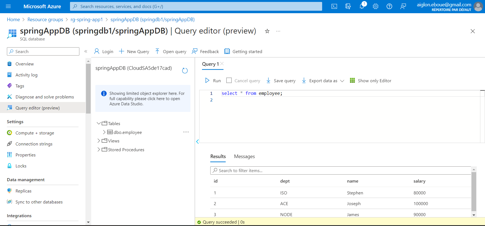

# INTRO CLOUD PROJECT
 
## 1. Création d'une application fullstack
https://github.com/JosephEboue/Azure_Spring-React-App
### a) Aperçu
- Ceci est une application basique d'étude avec un front et un back connecté à une base de données Azure SQL contenant les infomations des employees du groupe H3-Hitema. Voici ci-dessous un aperçu du rendu:
  
- L'application à été fait en local et conteneurisé avec [docker](https://www.docker.com/) et deployé un Azure App service avec un docker-compose.
### b) Choix des technologies
- Frontend: [reactJS](https://fr.legacy.reactjs.org/docs/getting-started.html).
  Mon choix c'est porté sur ce framework pour sa "Réutilisation sans problème des composants, Flexibilité et compatibilité ultimes et Haute performance renforcée par le DOM virtuel".
  Voici un aperçu du code:
  
- Backend: [Spring Framework](https://spring.io/projects/spring-framework), qui propose de nombreuses fonctionnalités de base pour le développement d'applications : un conteneur léger implémentant le design pattern IoC pour la gestion des objets et de leurs dépendances en offrant des fonctionnalités avancées concernant la configuration et l'injection automatique.
  
- BDD: [SQL](https://sql.sh/); afin d'avoir des données stockées dans une structure bien plus rigide et prédéfinie

 
## 2. Installation
- Pour débuter il est necessaire de [d'avoir un compte Azure sur](https://portal.azure.com/)
- Après de développement du front et du back. S'assurer que le connection string (JDBC) généré lors de la création du azure database soit inséré dans le fichier de config de l'application spring.
  
  
- Pour peupler la DB, vous pouvez faire des appels sur [postman](https://www.postman.com/) sur les URL http://localhost:9191/employee (pour des POST) et http://localhost:9191/employees (pour des GET) comme spécifié sur le controlleur Spring.

## 3. Dockerfile et docker-compose
- faire un dockerfile pour chaque service (front et back)
- Faire un docker-compose avec 3 services: un front, un back et une BDD azure.
  
  On obtien un resultat comme démontré sur l'aperçu

## 4. Configuration et Execution
- Créer un `groupe de resources` "ex. rg-spring-app1" pour regrouper toute les resources (BDD, App service, SQL server...)

- Créer une BDD Azure SQL
- Créer un `Container registry` sur azure pour pousser les images de mon front et back.
  
- Créer un `App Service` et choissir l'option docker-compose, pour pouvoir importer notre fichier.
 
[NB](): Sur configuration file, importer le docker-compose.yml  
Nous pouvons voir et modifier nos config sur `Deployment center` si neccessaire.

## 5. Déploiement & production
- Lancer l'application avec le domaine: `spring-react-app.azurewebsites.net` donc URL https://spring-react-app.azurewebsites.net/ et on obtiens un résultat comme sur l'aperçu plus haut.
  
### Scaling 
[Le scaling-out](https://azure.microsoft.com/fr-fr/resources/cloud-computing-dictionary/scaling-out-vs-scaling-up) à été changé de `free` à `Basic B1`. Car pour cet application le `pay-as-you-go` est le mieux adapté pour la mise en échelle.
  

## 6. Test
- Un plan de test [Jmeter](https://jmeter.apache.org/download_jmeter.cgi) à été mise en place pour les tests de charges. Voici un aperçu des tests affectué.
- Les test on été fait avec 1, 3 et 6 utilisateurs.
  
  
  